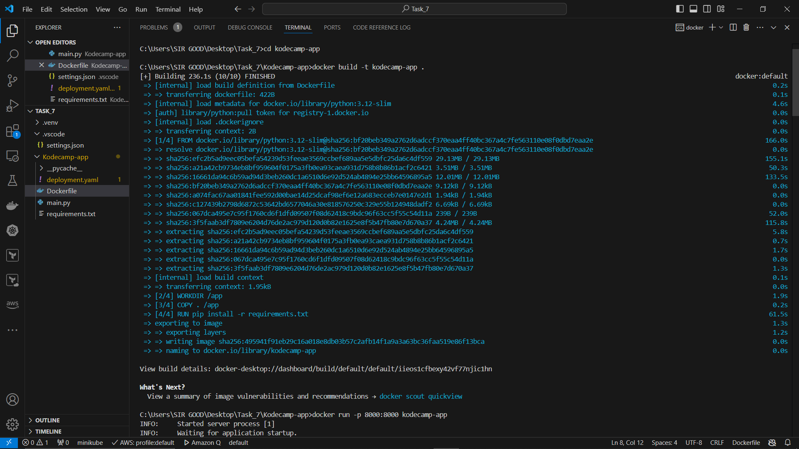
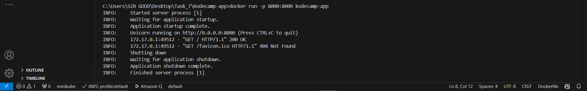
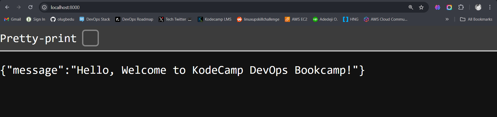
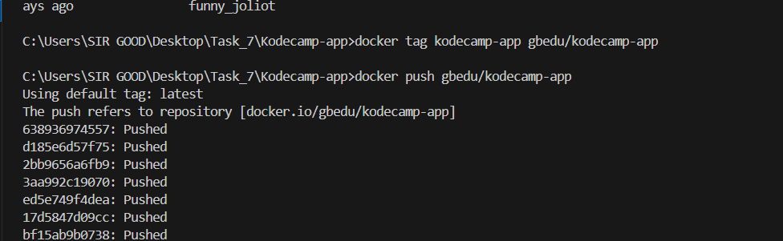
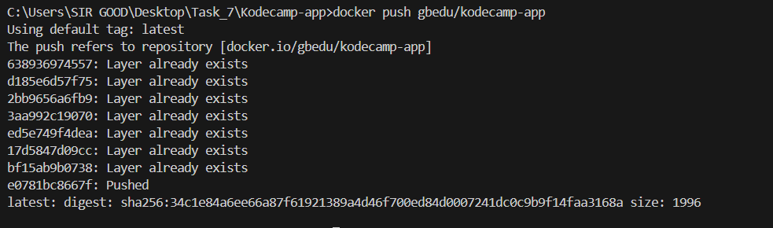
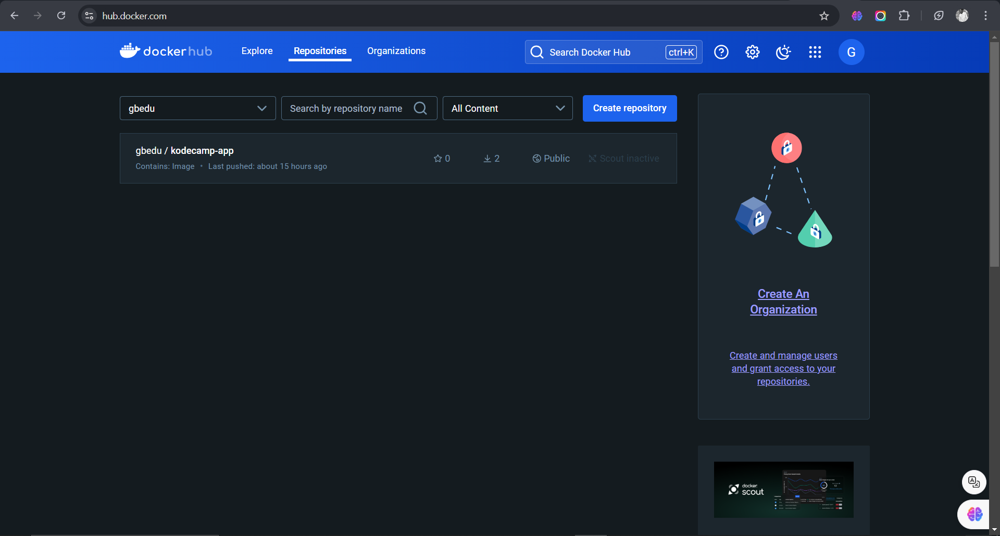
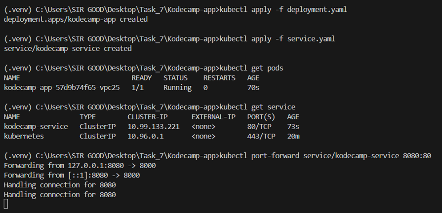
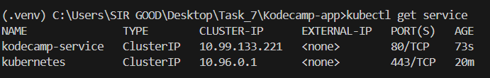
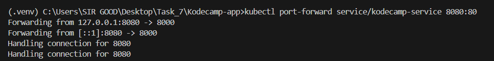
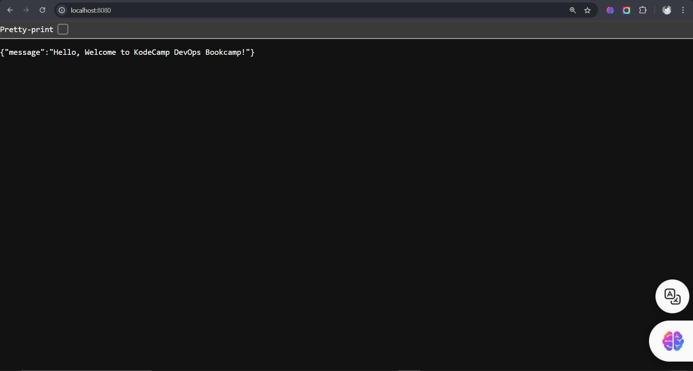

# Containerization (Docker) and Container Orchestration (K8s)

In today's ever-changing technology landscape, companies are looking for reliable and scalable ways to run and manage software. And containers have transformed the way we deliver software.

Container orchestration platforms have made it possible to deploy and manage containerised applications. Kubernetes is one such platform that has been a game-changer for developers who are dealing with the challenges of application deployments.

Kubernetes has made it so much easier to manage and scale deployments according to your needs. I am going to explain how to create a `Dockerfile`, `Docker image`, and `Deploy` it to a `Kubernetes cluster`, so get ready.

## Steps to follow.

#### 1. Create a simple web application(Python FastAPI):
You can use any framework of your choice, but here we used Python FastAPI.

```python
from fastapi import FastAPI

app = FastAPI()

@app.get("/")
def read_root():
    return {"message": "Hello, Welcome to KodeCamp DevOps Bookcamp!"}
```
#### 2. Dockerize the application:
- Write a Dockerfile to containerize the application.

```dockerfile
# Use the official Python image
FROM python:3.12-slim

# Set the working directory
WORKDIR /app

# Copy current directory contents into the container
COPY . /app

# Install dependencies
RUN pip install -r requirements.txt

# Make port 8000 available outside the container
EXPOSE 8000

# Run the app
CMD ["uvicorn", "main:app", "--host", "0.0.0.0", "--port", "8000"]
```

- Build the Docker image run the `docker build -t "your-app"` command, then to ensure it works correctly run the `docker run -p 8000:8000 "your-app"` command. To confirm this works visit your local host `localhost:8000 ` on your browser.





- Tag it `docker tag "your-app" "docker-username/your-app"` and Push the Docker image to a container registry (Docker Hub) `docker push "docker-username/your-app"`.




#### 3. Deploy the application to a Kubernetes cluster:

##### Set Up the Kubernetes Cluster
To deploy your application, you need to set up a Kubernetes Cluster that will run your pods and services. There are lot of clusters provided by multiple cloud providers like Google, Amazon and Microsoft. For this application, we will use `Minikube`.

Minikube is a tool that lets your run a single-node K8s cluster on your computer. It is a personal playground for trying out Kubernetes in your system.

Refer to [this](https://minikube.sigs.k8s.io/docs/start/) guide for setting up minikube on Mac or Windows. Check if Minikube was installed by running the `minikube version` command.

Run the `minikube start` command to start a local Kubernetes cluster.

##### Create a Kubernetes manifest file for a Deployment to deploy the Docker image.

`Deployment.yaml`
```yaml
apiVersion: apps/v1
kind: Deployment
metadata:
  name: kodecamp-app
```
- apiVersion: Specifies the API version of the resource,
- kind: Defines the type of resource, which is a Deployment.
- metadata: Contains metadata about the deployment. Here, we have specified the name of the deployment and set the namespace to kodecamp-app.

```yaml
spec:
  replicas: 1
  selector:
    matchLabels:
      app: kodecamp-app
  template:
    metadata:
      labels:
        app: kodecamp-app
    spec:
      containers:
      - name: kodecamp-app
        image: gbedu/kodecamp-app
        imagePullPolicy: Always
        ports:
        - containerPort: 8000
        resources:
            requests:
                memory: "128Mi"
                cpu: "250m"
            limits:
                memory: "256Mi"
                cpu: "500m"
```

- `spec`: Describes the desired state of the deployment.
- `replicas`: Specifies the desired number of replicas (instances) of the application to run, which is 1 in this case.
- The `selector` and `matchLabels` fields specify labels that the deployment can identify the pods with.
- `template`: Defines a template for your pod. in this case, `kodecamp-app` is the label with which the pod should be identified.
- `spec field under template` describes the desired state of the pod, including the list of containers. In this case we have just one container, with the name `kodecamp-app`, and the image it should pull from my Docker Hub `gbedu/kodecamp-app`, and the port to which it is exposed. `imagePullPolicy` specifies the image pull policy. Here, I have used Always (always pull the latest image from the registry).
- resources: This section is used to specify the resource requests and limits for the containers in a pod. This helps Kubernetes manage resources efficiently and ensure that your application gets the resources it needs while preventing it from using too many resources. `Resource requests` are the `minimum` amount of resources that Kubernetes will allocate to the container. If the requested resources are not available, the pod will not be scheduled. `Resource limits` are the `maximum` amount of resources that the container can use. If the container tries to use more than the specified limits, Kubernetes will rescrict (throttle) it or, in the case of memory, potentially terminate the container.

##### Create a Kubernetes Service of type ClusterIP to expose the application.
`Service.yaml`

```yaml
apiVersion: v1
kind: Service
metadata:
  name: kodecamp-service
```
Similar to the deployment.yaml, the API version and metadata about the service with name kodecamp-service.
```yaml
spec:
  type: ClusterIP
  selector:
    app: kodecamp-app
  ports:
  - protocol: TCP
    port: 80
    targetPort: 8000
  ```

- Here, `spec` field describes the desired state of the Service which is of type `Cluster IP`.
- `selector`: Specifies the label that identifies with the pod the service should direct traffic to.
- `ports`: Specifies the list of ports that the service should expose.
- `protocol`: Specifies the type of protocol allowed.
- `port`: Specifies the port that the service listens on. External traffic will come to this port, while the targetPort specifies the port on the pods that the service should forward traffic to. In this case, the incoming traffic on the service's port 80 will be sent to the pods on port 8000.

#### 4. Create the Pod, Deployment, and Service
Use `kubectl apply` to apply the above configurations and create the pods, deployment, and service.

`kubectl apply -f deployment.yaml`

`kubectl apply -f service.yaml`

`Alternatively`, you can also put both these configs in a single `manifest.yaml` file and run the apply command just once.

`kubectl apply -f manifest.yaml`

Check your pods, deployments, and services using the `kubectl get "commands"` ("pods", "service").



Make sure you have executed the `minikube start` command before applying any files, as you need to start a cluster to run your pods.

You can see from the above output that the pod is running fine. If it shows 0/1 under READY, that means there was some issue while creating the container. You should check if your application is working properly before deploying again.

You can also check the pod logs with the `kubectl logs` command.

Minikube also provides a dashboard that shows all your pods, deployments, and services as a web UI. Run the `minikube dashboard` command and your browser will spring up the dashboard.

#### 5. Test the deployment:
- Port-forward your service to a localhost port and access it through your web browser. To do that run the `kubectl port-forward service/app-service 8080:80` command.



- Verify that the application displays the expected message. 


#### 6. Scaling Your Application
Your application is up and running. With increasing demand, you may need to scale up your application to ensure optimal performance.

To scale up your application, increase the number of replicas of your deployment by running the following command:

`kubectl scale deployment <deployment-name> --replicas=<desired-number>`

Specify the desired number of replicas and it will scale up your pods.

`kubectl scale deployment your-app --replicas=4`

After running the above command, run `kubectl get deployments` to see that the number of replicas has gone up.

Alternatively, you can modify the Deployment YAML file by changing the number of replicas and running the kubectl apply command again.

If you no longer need a large number of pods and want to scale down your application, just run the same command and specify a smaller number of replicas.

`kubectl scale deployment your-app --replicas=2`

### Bonus (Optional):
- Configure a ConfigMap to externalize the message "Hello, Kubernetes!".

`configmap.yaml`
```yaml
apiVersion: v1
kind: ConfigMap
metadata:
  name: kodecamp-config
data:
  MESSAGE: "Hello, Kubernetes!"
  ```
- update your application to read this message from the ConfigMap.

```python
import os
from fastapi import FastAPI

app = FastAPI()

@app.get("/")
def read_root():
    message = os.getenv('MESSAGE', 'Hello, Welcome to KodeCamp DevOps Bookcamp!')
    return {"message": message}
```

- Create a Secret to store a sensitive piece of information.

`secret.yaml`
```yaml
apiVersion: v1
kind: Secret
metadata:
  name: kodecamp-secret
type: Opaque
data:
  PASSWORD: c2VjcmV0cGFzc3dvcmQ= #it's just for practice
```

- update your application to use this Secret.
```python
import os
from fastapi import FastAPI

app = FastAPI()

@app.get("/")
def read_root():
    message = os.getenv('MESSAGE', 'Hello, Welcome to KodeCamp DevOps Bookcamp!')
    password = os.getenv('PASSWORD', 'defaultpassword')
    return {"message": message, "password": password}
```
## Screenshots of your working application.


## Docker image URL from Docker Hub 
[dockerhub repo](https://hub.docker.com/repository/docker/gbedu/kodecamp-app)

## Conclusion
Kubernetes is a popular container orchestration platform. Having a strong grasp on its concepts helps you leverage this platform for your application.

My objective was to provide a comprehensive, step by step guide on deploying your application to a Kubernetes cluster. I also set out to establish a foundation on some key concepts of Kubernetes that include pods, deployments, services and the cluster itself.

I started with a simple Python app and packaged it into a Docker image. Once you were clear with the key concepts, I gave detailed steps right from installation and setting up the Kubernetes cluster to deploying your application as pods and exposing them through services.

Kubernetes has taking over the cloud landscape and it is here to stay. I hope I was able to make Kubernetes easy for you. This will surely help you deploy your applications to any Kubernetes cluster, not just the ones I mentioned.

If you are unable to understand the content or find the explanation unsatisfactory, let me know. New ideas are always appreciated! Feel free to connect with me on [Linkedin](https://www.linkedin.com/in/adedejiolugbedu/) . Till then, goodbye!